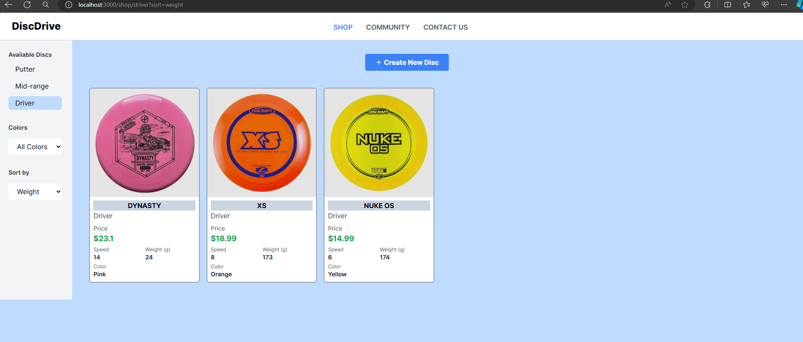
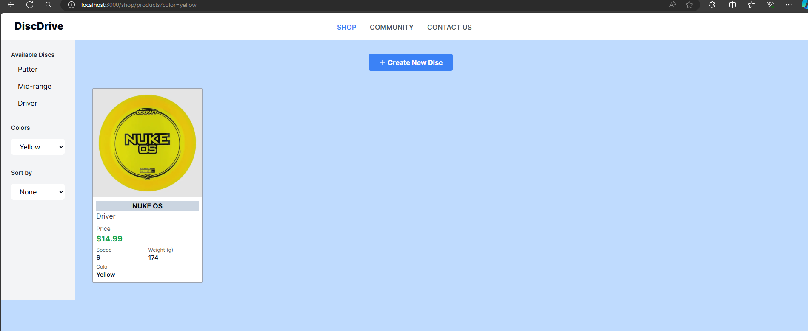

# DiscDrive

DiscDrive is an e-commerce platform specializing in the sale of golf discs, with a primary focus on facilitating the creation of new disc listings. Utilizing Next.js v14 and Tailwind CSS, DiscDrive enables users to effortlessly add new discs to their inventory.

# 👍 Features Implemented

## 1. Main Product Grid

Displays tiles for each disc listing, representing different discs available for purchase. Each tile includes details such as disc type, name, speed, color, weight, price, and an image.


## 2. Disc Cards

Represents individual discs with essential details, enhancing the browsing experience for users.


## 3. Popup Modal Form

Includes a modal form for creating a new disc listing. The form includes input fields for all disc attributes specified, including an image upload feature.


## 4. Image Upload

Utilizes Cloudinary for seamless image upload functionality.


## 5. File Size Limit

Implements a file size limit of 5 MB for the image upload feature to ensure efficient handling of images.

## 6. Listing Creation

Enables users to submit the form and create new disc listings, which are saved to the database using MongoDB.


## 7. Sorting and Filtering

### Sorting

Allows users to sort the list of discs based on different attributes such as price, speed, and weight. This enables users to easily find discs according to their preferences.

- Price
- Speed
- Weight



### Filtering

Provides filtering options to narrow down the list of discs based on specific attributes.

- Color: Filter discs by their color.
- Disc Type: Filter discs by their type, such as putter, mid-range, or driver.



## 8. Responsive Design

Ensures that the marketplace product grid is responsive to the width of the user's screen, providing a seamless experience across different devices.


## 💣💣 Issues Encountered

### 1. **Form** and **Cloudinary**

Integrating the image upload with Cloudinary presented challenges, particularly with passing props. Opted to use Shadcnui form to abstract away complexity.

### 2. **Popup Modal Form** and **Cloudinary**

Initially used Shadcnui dialog component for accessibility features, but encountered issues with Cloudinary integration due to overlay preventing clicks. Resolved by creating a new modal.

## 💭 Things to improve

### 1. Styles Reorganization

### 2. Modal Accessibility

### 3. Error Handling

### 4. File Structure

### 5. Code Clean-Up

## Installation

To run the project locally, follow these steps:

1. Clone the repository:

```bash
git clone https://github.com/rdayupay/discdrive.git
```

2. Navigate into the project directory

```bash
cd discdrive
```

3. Install dependencies

```bash
npm install
```

4. Start the development server

```bash
npm run dev
```

## Account Setup Instructions

Before running the DiscDrive project locally, you need to set up accounts for MongoDB and Cloudinary. Follow the steps below to create accounts and add the necessary credentials to your .env file.

### 1. MongoDB Account Setup

1. Go to the MongoDB website: https://www.mongodb.com/
2. Sign up for an account or log in if you already have one.
3. Create a new project for your DiscDrive application.
4. Navigate to the project dashboard and create a new MongoDB cluster.
5. Once the cluster is created, click on "Connect" and then select "Connect your application".
6. Copy the connection string provided.

### 2. Cloudinary Account Setup

1. Go to the Cloudinary website: https://cloudinary.com/
2. Sign up for an account or log in if you already have one.
3. After logging in, navigate to the dashboard and find your cloud name.
4. Make sure to enable unsigned uploads in the settings.

### 3. Add Credentials to .env File

In your DiscDrive project directory, create a .env file if you don't already have one. Add the following lines to the .env file and replace the placeholders with your actual MongoDB connection string and Cloudinary cloud name.

```env
NEXT_PUBLIC_MONGODB_URL=<your_mongodb_connection_string>

NEXT_PUBLIC_CLOUDINARY_CLOUD_NAME=<your_cloudinary_cloud_name>
```

Once you've added the credentials to your .env file, you're ready to run the DiscDrive project locally. Follow the installation instructions provided earlier to set up and run the project.
