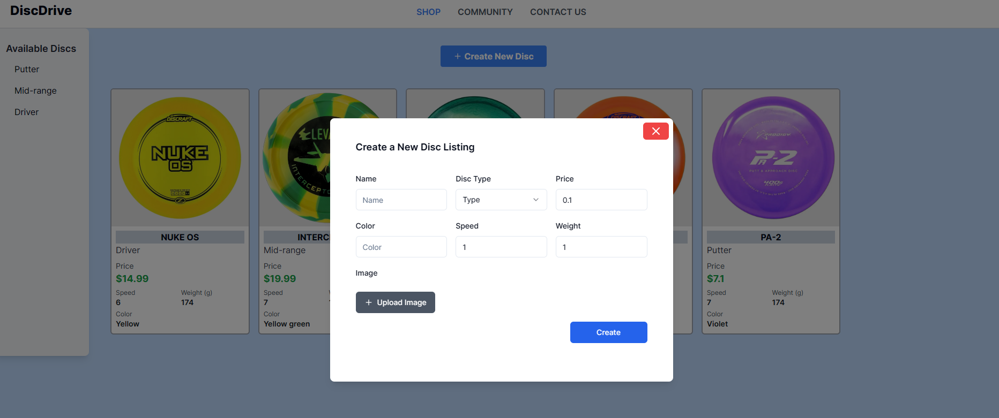

# DiscDrive

DiscDrive is an ecommerce web page for purchasing disc golf discs, built using Next.js v14 and Tailwind CSS.

# 👍 Features Implemented

## 1. Main Product Grid

Displays tiles for each disc listing, representing different discs available for purchase. Each tile includes details such as disc type, name, speed, color, weight, price, and an image.


## 2. Disc Cards

Represents individual discs with essential details, enhancing the browsing experience for users.


## 3. Popup Modal Form

Includes a modal form for creating a new disc listing. The form includes input fields for all disc attributes specified, including an image upload feature.



## 4. Image Upload

Utilizes Cloudinary for seamless image upload functionality.


## 5. File Size Limit

Implements a file size limit of 5 MB for the image upload feature to ensure efficient handling of images.

## 6. Listing Creation

Enables users to submit the form and create new disc listings, which are saved to the database using MongoDB.


## 7. Responsive Design

Ensures that the marketplace product grid is responsive to the width of the user's screen, providing a seamless experience across different devices.


## 🚶 In Progress (Sidebar)

### 1. **Sorting**

### 2. **Filtering**

## 💣💣 Issues Encountered

### 1. **Form** and **Cloudinary**

Integrating the image upload with Cloudinary presented challenges, particularly with passing props. Opted to use Shadcnui form to abstract away complexity.

### 2. **Popup Modal Form** and **Cloudinary**

Initially used Shadcnui dialog component for accessibility features, but encountered issues with Cloudinary integration due to overlay preventing clicks. Resolved by creating a new modal.

## 💭 Things to improve

### 1. Styles Reorganization

### 2. Modal Accessibility and Responsiveness

### 3. Error Handling

### 4. File Structure

### 5. Code Clean-Up

## Installation

To run the project locally, follow these steps:

1. Clone the repository:

```bash
git clone <repository-url>
```

2. Navigate into the project directory

```bash
cd discdrive
```

3. Install dependencies

```bash
npm install
```

4. Start the development server

```bash
npm run dev
```
